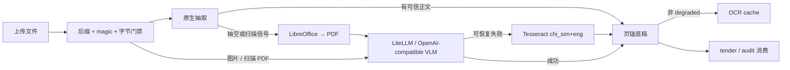

# 文档摄取与 OCR 子系统

## 定位与边界

`server/ocr` 把上传文档转换为带页锚的可审计底稿，供 tender/audit 等上层业务消费。它负责格式
校验、原生抽取、Office 转换、VLM/Tesseract OCR、缓存和流式单元，不负责评标判断，也不执行
Office 宏、破解加密文件或启动 GPU HPS 服务。

## 支持矩阵

唯一格式源为 `shared/supported-document-formats.json`，当前包含 24 个 canonical 后缀：

| 类别 | 后缀 | 主路径 |
|---|---|---|
| 文本 | txt/csv/md/json/tsv | 编码校验后直读 |
| 图片 | png/jpg/jpeg/tif/tiff/bmp/webp | VLM，失败后 Tesseract |
| Word | doc/docx/odt | native/legacy reader；抽空时 Office→PDF→OCR |
| Excel | xls/xlsx/xlsm/xlsb/ods | xlrd/openpyxl/pyxlsb；抽空时 Office→PDF→OCR |
| PowerPoint | ppt/pptx/odp | PPTX 文本/表格；扫描图片信号不足时 Office→PDF→OCR |
| PDF | pdf | 文本层优先；扫描页按页 VLM→Tesseract |

前端 `accept` 和后端分类器均从 manifest 派生；generator 的 `--check` 防止已提交 TypeScript 漂移。

## 主要数据流

## 组件现状

| 组件 | 职责 |
|---|---|
| `formats.py` | 加载并校验 canonical manifest |
| `classify.py` | 按格式选择 native/convert/OCR 路由 |
| `native.py` | Word/Excel/PPTX/PDF/text 原生抽取与 PPTX 嵌套图片信号 |
| `office_convert.py` | 隔离 profile、禁宏、超时进程组回收、PDF 输出校验 |
| `page_render_worker.py` | 子进程逐页渲染 framed PNG，分配前限制像素 |
| `engine.py` | VLM、Tesseract、Paddle 路由及统一资源/异常边界 |
| `pipeline.py` | native→convert→OCR 编排、底稿有效性与页级事件 |
| `cache.py` | 只缓存可信的非 degraded OCR 结果 |

## 安全与失败语义

- 图片在 OCR backend 分派前统一执行 stat、实际读取长度、Pillow 格式/完整性/像素门禁。
- PDF 限制页数、单页像素、总渲染字节和超时；失败页之后才切 Tesseract，不重复成功页。
- LibreOffice 使用独立临时 profile，`MacroSecurityLevel=3` 且
  `DisableMacrosExecution=true`，`shell=False`，超时后 TERM→KILL 整个进程组。
- VLM 的可恢复 transport/protocol/decode/body-read 错误归一为 `OcrDependencyError`；
  `MemoryError`、取消和进程退出异常不伪装成普通 fallback。
- 空 stdout、仅页锚或空白 OCR 不算有效底稿；degraded 结果不写缓存。

## 镜像与配置边界

后端 ARM64 CPU 镜像包含固定 Python 解析依赖，以及 LibreOffice Writer/Calc/Impress、Tesseract
chi_sim/eng、antiword/catdoc 和 CJK 字体；前端保持独立镜像。OCR endpoint、模型、cloud/local 开关
均由目标环境配置注入，不烘焙演示机 secrets 或覆盖目标 Compose、knowledge/data/logs。

成品镜像验收使用真实 fixture，分别证明 VLM 成功和故意不可达 VLM 后的 Tesseract degraded；
smoke 强制关闭缓存并要求 `from_cache=false`。远端是否部署成功仍以 T6 的镜像内实跑为准。

## 上游依据

- LibreOffice CLI 参数：<https://help.libreoffice.org/latest/en-US/text/shared/guide/start_parameters.html>
- LibreOffice 禁宏配置 schema：<https://github.com/LibreOffice/core/blob/8a754ebff5e90b3293ca03b3c91d7165fdbe038d/officecfg/registry/schema/org/openoffice/Office/Common.xcs#L2149-L2175>
- PaddleOCR 3.x 安装能力：<https://github.com/PaddlePaddle/PaddleOCR/blob/2661c7c0ef5c613e8f93c6e93b2e052399f0f854/docs/version3.x/installation.en.md#L9-L51>
- Pillow `verify()` 与像素保护：<https://pillow.readthedocs.io/en/stable/reference/Image.html#PIL.Image.Image.verify>
- Debian Tesseract 简体中文包：<https://packages.debian.org/bookworm/tesseract-ocr-chi-sim>
