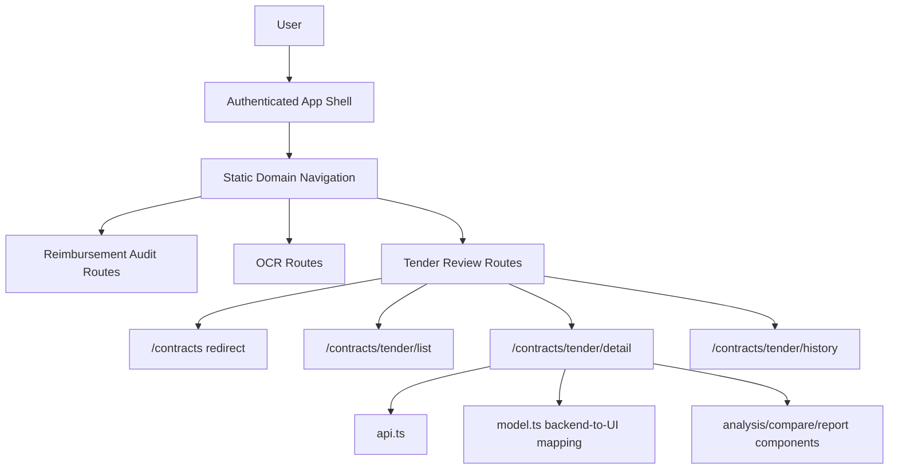
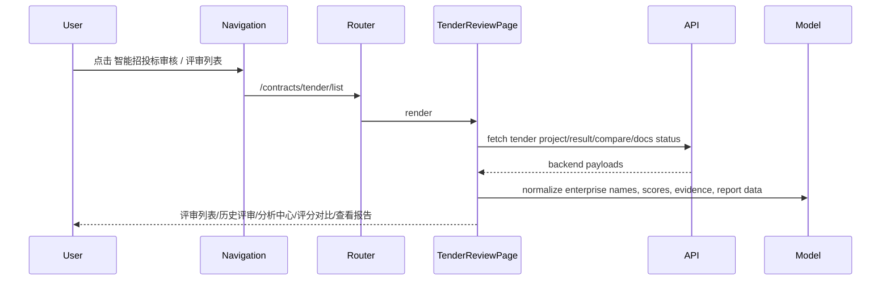

# Agent Front Architecture

## 一句话

`agent-front` 是企业审核平台的 Vite/React/TanStack Router 前端壳，按业务域提供智能报销审核、OCR 识别、智能招投标审核等入口，并通过 feature 目录隔离页面、API/model 映射和业务组件。

## 组件总览

## 子系统索引

| 子系统 | 档案 | 一句话描述 |
|---|---|---|
| Frontend Contract Tender Review | `frontend-contract-tender-review.md` | 智能招投标审核下的评审列表、历史评审、分析中心、评分对比与报告查看 |

## 数据流

## 边界

- 不把项目管理/招投标审核 mock 流程挂到 `/audit/*` 报销审核流程。
- 不修改 `/ocr` 页面或 OCR API。
- 不恢复旧 `/contracts/tender-review` 路由族；当前 tender 路由以
  `/contracts/tender/list`、`/contracts/tender/detail`、
  `/contracts/tender/history` 为准。
- 不让根 `.gitignore` 的运行时 `data/` 规则继续误伤前端源码 `src/features/**/data/`。
- 不把统一社会信用代码或 claim id 当作投标人展示名称；企业名称可用时必须优先展示企业名称。

## 关键决策

- 合同审查域承载招投标审核 → `compound/2026-06-19-decision-contract-tender-review-domain.md`
- 业务导航静态化 → `compound/2026-06-19-decision-front-domain-navigation.md`
