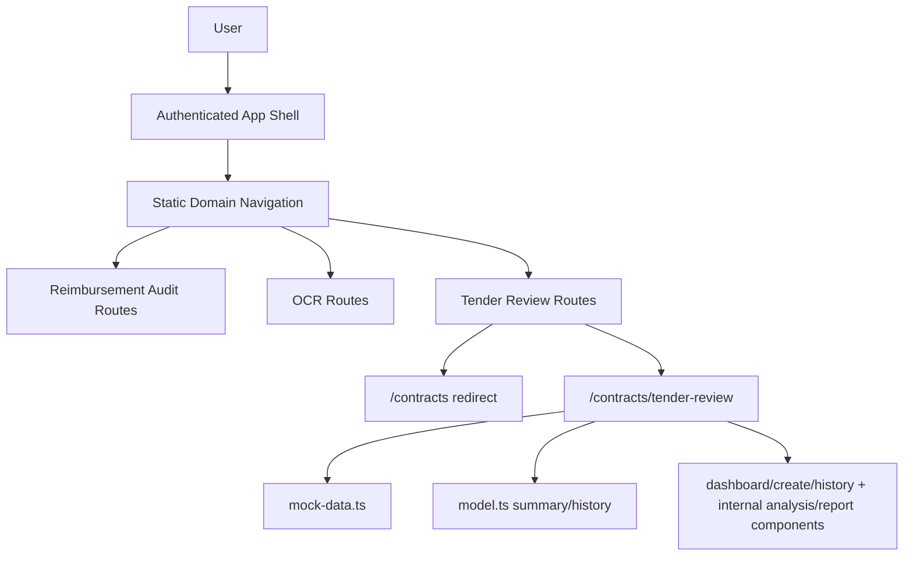
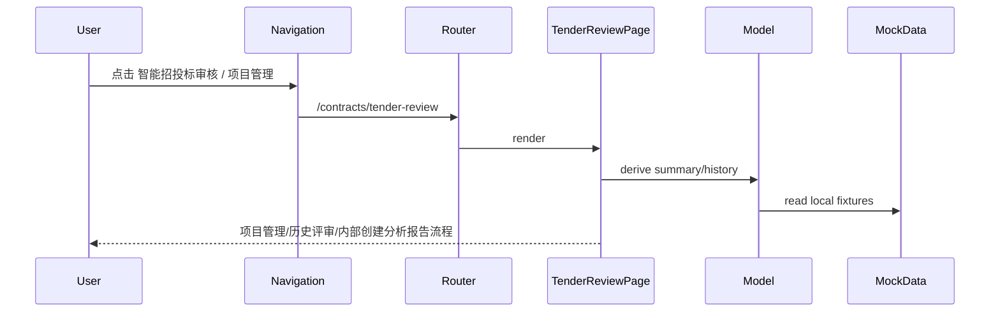

# Agent Front Architecture

## 一句话

`agent-front` 是企业审核平台的 React/TanStack Router 前端壳，按业务域提供智能报销审核、OCR 识别、智能招投标审核等静态导航入口，并通过 feature 目录隔离页面、mock/model 和未来接口替换边界。

## 组件总览

## 子系统索引

| 子系统 | 档案 | 一句话描述 |
|---|---|---|
| Frontend Contract Tender Review | `frontend-contract-tender-review.md` | 智能招投标审核下的项目管理、历史评审，以及按钮进入的创建/分析/报告 mock 前端 |

## 数据流

## 边界

- 不把项目管理/招投标审核 mock 流程挂到 `/audit/*` 报销审核流程。
- 不修改 `/ocr` 页面或 OCR API。
- 不在 mock 阶段接真实上传、PDF 导出或后端审核接口；分析、评分对比和报告均为内部 mock 页面。
- 不让根 `.gitignore` 的运行时 `data/` 规则继续误伤前端源码 `src/features/**/data/`。

## 关键决策

- 合同审查域承载招投标审核 → `compound/2026-06-19-decision-contract-tender-review-domain.md`
- 业务导航静态化 → `compound/2026-06-19-decision-front-domain-navigation.md`
