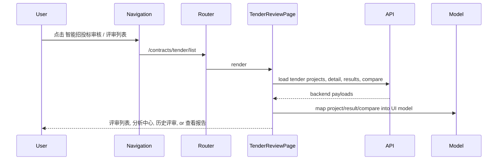

# Frontend: Intelligent Tender Review

## 角色

`智能招投标审核` 是合同/招投标域下的前端功能。它最初由 Design Canvas 原型
迁入，现在已收敛为后端连接的评审列表、分析中心、历史评审和报告查看流程。

## 路由与导航

- `/contracts/tender/list`: `智能招投标审核 > 评审列表`。
- `/contracts/tender/detail?view=analysis`: `评审列表 > 分析中心`。
- `/contracts/tender/detail?view=report`: 打开同一项目的报告查看界面。
- `/contracts/tender/history`: `智能招投标审核 > 历史评审`。
- `/contracts`: 兼容老链接，重定向到 `/contracts/tender/list`。
- 旧 `/contracts/tender-review` 路由族已删除，不再保留兼容入口。
- 侧边栏不再包含 `合同审查清单`。

## 模块边界

- `features/contract/tender-review/api.ts`: tender project、result、compare、docs status API。
- `features/contract/tender-review/model.ts`: 后端 tender 数据到前端分析/报告模型的映射。
- `features/contract/tender-review/use-tender-review-page.ts`: `dashboard | create | history | analyzing | analysis | report` 页面态、轮询恢复与路由跳转。
- `features/contract/tender-review/components/`: `项目管理`、`创建评审`、`历史评审` 以及按钮进入的 `分析中心` / `评分对比` / `审核报告` UI。

## 数据流

## 约束

- 侧边栏只暴露 `评审列表` 和 `历史评审`；`分析中心`、`评分对比`、`查看报告`
  通过列表、历史或详情内按钮进入。
- 报告页以项目为粒度打开；从详情或历史点击 `查看报告` 都应进入报告视图，
  不应落到进行中分析空态。
- 可见投标人名称优先使用企业名称，不用统一社会信用代码或 claim id 充当名称。
- 分项得分紧凑表格保持稳定等高，避免展开/折叠时行高漂移。
- 中间列定位项点击后，除更新 active evidence 外，还要滚动右侧证据面板到对应项。
- 后续真实接口变化优先约束在 `api.ts` / `model.ts` / page hook，不修改
  `/audit/*` 或 `/ocr`。
