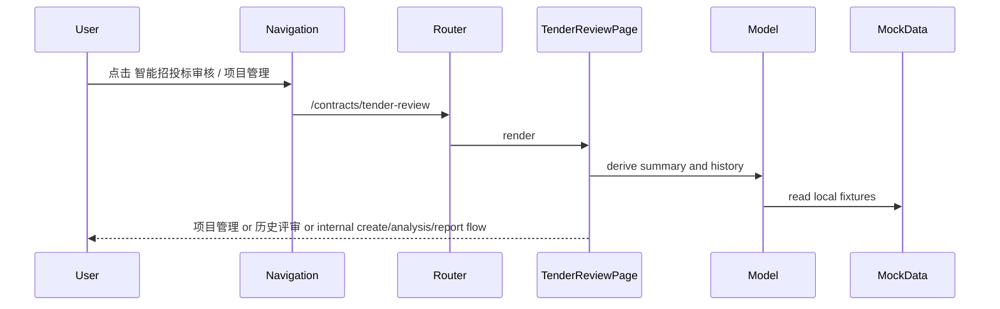

# Frontend: Intelligent Tender Review

## 角色

`智能招投标审核` 是合同/招投标域下的 mock 前端功能。它依据 Design Canvas
原型的入口界面重建，不引入原型 runtime，也不复刻旧空白合同审查清单页。

## 路由与导航

- `/contracts/tender-review`: `智能招投标审核 > 项目管理`。
- `/contracts/tender-review/history`: `智能招投标审核 > 历史评审`。
- `/contracts`: 兼容老链接，重定向到 `/contracts/tender-review`。
- 侧边栏不再包含 `合同审查清单`。

## 模块边界

- `features/contract/tender-review/mock-data.ts`: 原型工作台和历史评审 mock。
- `features/contract/tender-review/model.ts`: 工作台统计与历史筛选。
- `features/contract/tender-review/use-tender-review-page.ts`: `dashboard | create | history | analysis | report` 页面态。
- `features/contract/tender-review/components/`: `项目管理`、`创建评审`、`历史评审` 以及按钮进入的 `分析中心` / `评分对比` / `审核报告` UI。

## 数据流

## 约束

- 当前阶段不调用真实接口，不上传真实文件。
- 项目管理页使用统一表格查询、状态筛选和分页控件。
- `创建评审` 是 mock 表单与进度流程，不是菜单入口。
- 不提供 `分析中心`、`评分对比`、`审核报告` 独立菜单入口；历史表格、工作台项目和创建流程按钮进入内部 mock 页面。
- 后续真实接口替换应优先替换 mock/model 层，不修改 `/audit/*` 或 `/ocr`。
